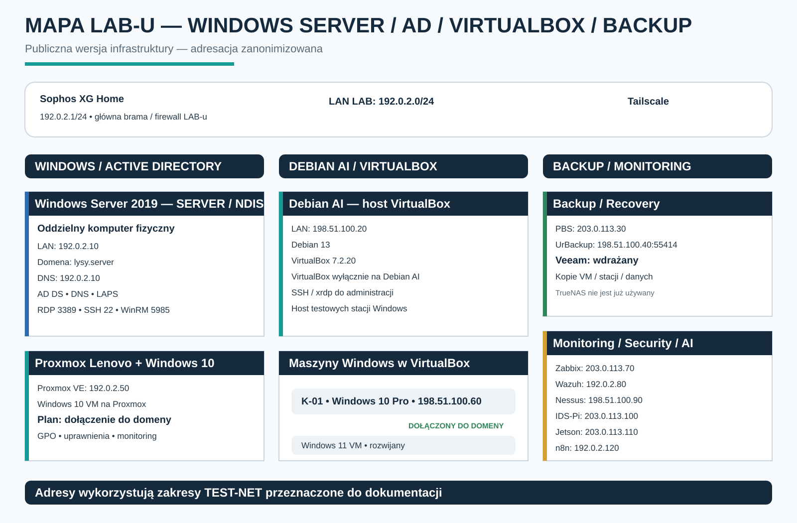

# Windows Server AD & VirtualBox Homelab

Ta część mojego homelabu koncentruje się na administracji środowiskiem Windows, Active Directory, DNS, zdalnym zarządzaniu stacjami oraz integracji maszyn Windows uruchomionych na VirtualBox i Proxmox VE.

## Najważniejsze założenia

- Windows Server 2019 działa na **oddzielnym komputerze fizycznym NDIS**.
- VirtualBox działa **wyłącznie na Debian AI**.
- Stacje Windows 10/11 są stopniowo dołączane do domeny `lysy.server`.
- Windows 10 na Proxmox Lenovo jest kolejną maszyną planowaną do dołączenia do domeny.
- Backup opiera się na **PBS + UrBackup**, a **Veeam jest obecnie wdrażany**.

## Windows Server 2019 — SERVER / NDIS

| Parametr | Wartość |
|---|---|
| Host | `SERVER` |
| Sprzęt | oddzielny komputer fizyczny `NDIS` |
| System | Windows Server 2019 Standard |
| LAN | `192.0.2.10/24` |
| Domena | `lysy.server` |
| DNS | `192.0.2.10` |
| SSH | `22/tcp` |
| RDP | `3389/tcp` |
| WinRM | `5985/tcp` |

Rola serwera obejmuje:

- Active Directory Domain Services,
- DNS,
- zarządzanie kontami i grupami,
- administrację stacjami domenowymi,
- LAPS,
- RDP / OpenSSH / WinRM / PowerShell Remoting,
- diagnostykę logowania i usług domenowych.

## Debian AI + VirtualBox

Debian AI jest dedykowanym hostem VirtualBox.

| Parametr | Wartość |
|---|---|
| Host | Debian AI |
| LAN | `198.51.100.20` |
| System | Debian 13 |
| VirtualBox | `7.2.20` |

VirtualBox nie jest instalowany na Windows Server.

### Maszyny VirtualBox

#### K-01
- Windows 10 Pro
- `198.51.100.60`
- FQDN: `K-01.lysy.server`
- maszyna dołączona do domeny

#### Windows 11
- zainstalowana maszyna testowa
- dalsza integracja z domeną w toku

Docelowo środowisko VirtualBox ma obejmować:

- 2 × Windows 10
- 2 × Windows 11

## Windows 10 na Proxmox Lenovo

Na hoście Proxmox Lenovo działa dodatkowa maszyna Windows 10.

- Proxmox Lenovo: `192.0.2.50`
- Windows 10: maszyna testowa
- plan: dołączenie do domeny `lysy.server`
- cel: testy centralnego zarządzania, GPO, uprawnień, monitoringu i zdalnej administracji

## Backup i recovery

Aktualny kierunek:

- **Proxmox Backup Server** — `203.0.113.30`
- **UrBackup** — `198.51.100.40:55414`
- **Veeam** — wdrażany dla środowiska Windows

## Monitoring i bezpieczeństwo

Środowisko jest integrowane z:

| Usługa | Adres |
|---|---|
| Zabbix | `203.0.113.70` |
| Wazuh | `192.0.2.80` |
| Nessus | `198.51.100.90` |
| IDS-Pi / Suricata / EveBox | `203.0.113.100` |
| Jetson / AI-SOC | `203.0.113.110` |
| n8n | `192.0.2.120` |

## Zakres praktyczny

Projekt rozwija praktyczne umiejętności w obszarach:

- Active Directory,
- DNS,
- konta i grupy domenowe,
- dołączanie Windows 10/11 do domeny,
- LAPS,
- GPO,
- RDP,
- OpenSSH,
- WinRM / PowerShell Remoting,
- diagnostyka usług Windows Server,
- zarządzanie maszynami Windows z centralnego serwera,
- integracja VirtualBox i Proxmox z domeną,
- backup i recovery,
- monitoring i analiza bezpieczeństwa.

## Najbliższe kroki

1. Dołączenie Windows 10 z Proxmox Lenovo do domeny.
2. Dołączenie kolejnych Windows 10/11 z VirtualBox.
3. Rozwój GPO i polityk administracyjnych.
4. Dalsza konfiguracja LAPS.
5. Wdrożenie Veeam.
6. Włączenie stacji domenowych do monitoringu Zabbix i Wazuh.
7. Dokumentowanie kolejnych case studies.

## Autor

**Michał Łysiński**  
Administrator IT | Windows Server | Active Directory | Proxmox | Monitoring | Security | Automation

GitHub: `Lysy-M`
